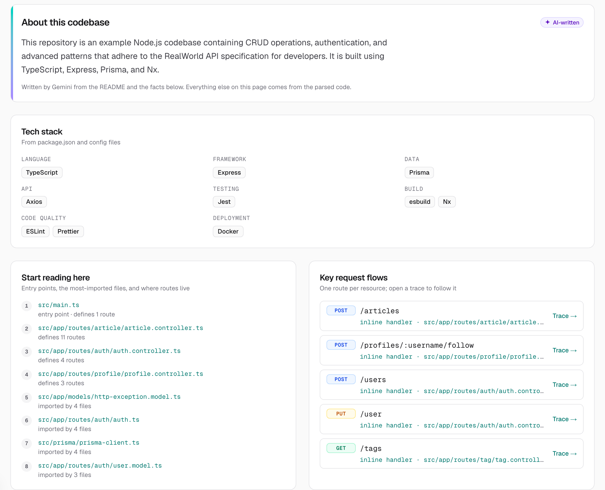
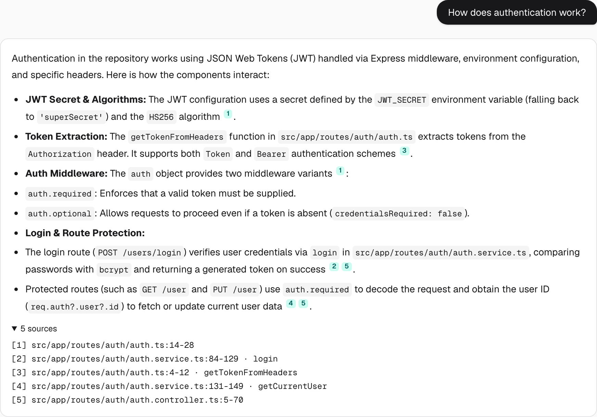
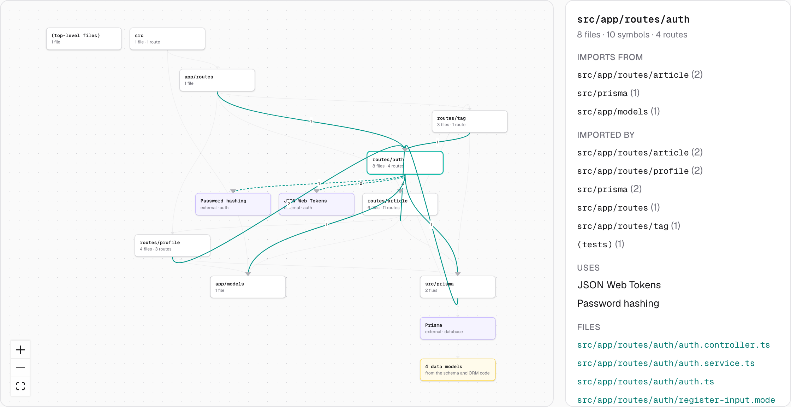
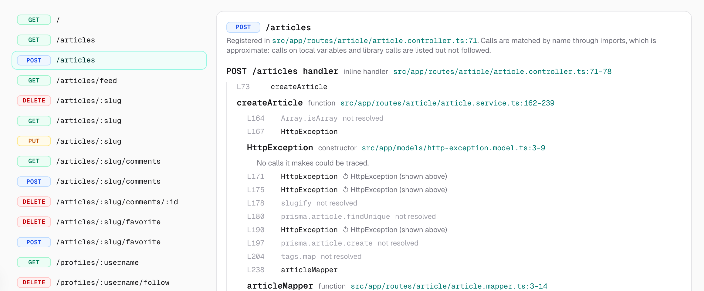
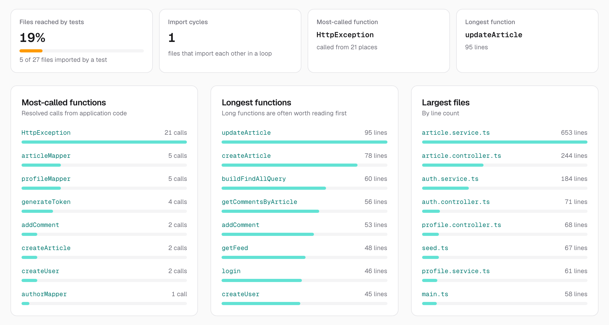
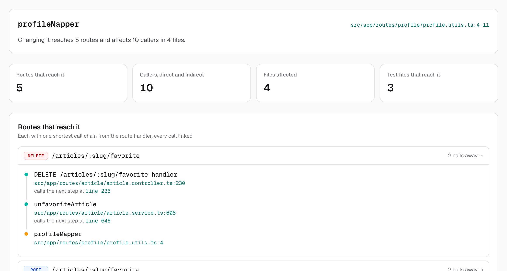
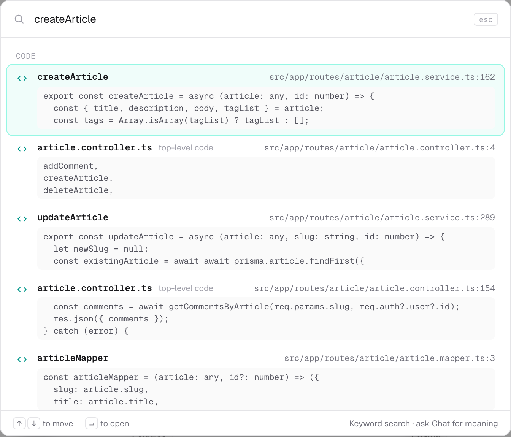
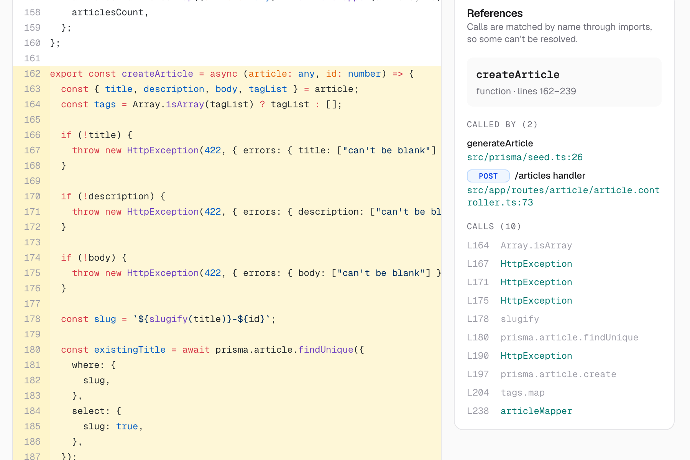
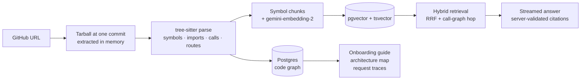
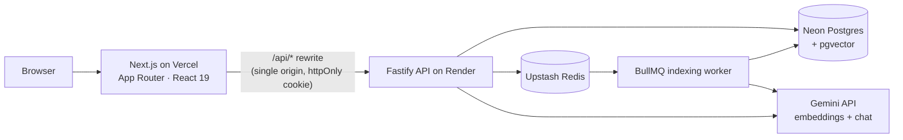

# Codebase Copilot

**Understand any TypeScript or JavaScript codebase, grounded in the actual code.** Paste a GitHub URL: Codebase Copilot parses the repository into a graph of its symbols, imports, calls and HTTP routes, maps its architecture, traces requests through it, and answers questions with citations to the exact files and lines, checked on the server.

[](https://github.com/mayank-pillai-99/codebase-copilot/actions/workflows/ci.yml)

**[Live demo →](https://codebase-copilot-mu.vercel.app)** Explore the demo repositories without an account. It runs on free hosting, so the first visit after a quiet spell can take up to a minute to wake the server.

[](docs/demo.mp4)

A one-minute tour of the RealWorld demo ([full-resolution MP4](docs/demo.mp4)).

## What it does

### An onboarding guide for every repository

Open a repository and start with a guide: a short summary (the one AI-written part, labelled as such), then facts from the code. You get the tech stack, the files to read first, key request flows, the largest folders, the data model, external services and configuration, each linking to the file that shows it.



### Answers with citations you can check

Ask "how does authentication work?" and get a streamed answer built only from retrieved code. Every `[n]` marker is validated on the server against the sources the model was given, and opens the cited lines at the indexed commit. Invented citations are removed and the answer is flagged.



### Architecture map

Folders, the imports between them, and the external services they use (databases, payments, auth, AI, email, …), detected from the code and `package.json`. Select anything to see the evidence: the files in a folder, and the exact import lines behind every arrow. Built deterministically from the parsed graph; no AI involved.



### Request tracing

Pick a route and follow its handler into the functions it calls, breadth-first through the call graph, with a link to every line. Calls that can't be resolved by name (library calls, methods on local variables) are shown as unresolved rather than guessed.



### Insights: a health check of the codebase

A tab of facts computed from the code graph, with no AI: the most-called functions, the longest functions and largest files; the riskiest files to change (many files depend on them, no test imports them) and which test file to read to learn each tested file; and import cycles between files (found with Tarjan's strongly connected components).



### Change impact: what could break?

Pick a function and see what depends on it, found by walking the call graph backwards: every caller, direct or indirect, grouped by file; the HTTP routes that reach it, each with a shortest call chain linked line by line; and the test files that exercise it, so you know what to run (or that nothing checks it). Open it from the References panel or the Impact tab. No AI.



### Search and navigate like an IDE

Press <kbd>⌘K</kbd> on any repository page to search file names (fuzzy, instant) and code (full-text, as you type) with previews. Searching an identifier lands on its definition first. In the code viewer, a References panel shows who calls the selected function and what it calls, including inline route handlers named by their route.





## How it works



1. **Ingest.** The repository is downloaded as a tarball at a resolved commit and read in memory. Nothing from it is written to disk or executed. Limits on archive size, file count and chunk count keep it within free hosting.
2. **Parse.** tree-sitter extracts symbols, imports, calls and HTTP routes (Express-style routers and Next.js route handlers). Imports are resolved through relative paths, `tsconfig` paths and workspace packages; calls are resolved by name through import bindings, re-exports, namespaces, static methods and `this`.
3. **Index.** Each function, class or method becomes one chunk with a context header, embedded at 768 dimensions and indexed with HNSW, alongside a generated `tsvector` over identifier-split text.
4. **Retrieve.** Vector and full-text candidates are fused with Reciprocal Rank Fusion, then expanded one hop along the call graph, so a question about a handler also finds the service it calls.
5. **Answer.** The model sees only numbered excerpts, treats code as untrusted data, and streams over SSE; citations are validated before they're saved. If the primary model is overloaded, it falls back to a lighter one before any text streams.

## Architecture



Everything runs on free tiers with no credit card: see [docs/deployment.md](docs/deployment.md).

## Tech stack

| Layer         | Tools                                                                                    |
| ------------- | ---------------------------------------------------------------------------------------- |
| Frontend      | Next.js 16 (App Router), React 19, TypeScript, Tailwind CSS 4, React Flow + dagre, Shiki |
| API           | Fastify 5, zod, Prisma 7, BullMQ, pino, JWT in httpOnly cookies, Argon2id                |
| Data          | PostgreSQL with pgvector (HNSW) and full-text search, Redis                              |
| Code analysis | web-tree-sitter (TypeScript, TSX, JavaScript grammars)                                   |
| AI            | Gemini `gemini-embedding-2` (768-d) and Gemini Flash through LangChain.js interfaces     |
| Quality       | Vitest (unit + integration against real Postgres), ESLint, Prettier, GitHub Actions      |
| Hosting       | Vercel, Render (Docker), Neon, Upstash                                                   |

## Engineering notes

A few decisions worth reading about. Each has an ADR in [docs/decisions](docs/decisions/).

- **Citations are checked, not trusted.** The server validates every `[n]` against the chunks it retrieved; file paths and line numbers shown to users come from the database, never from model output.
- **One snapshot per commit, shared by all users.** Commits are immutable, so parsing and embedding happen once per SHA, and all retrieval, caching and answers are scoped to a snapshot.
- **Hybrid retrieval with graph expansion.** RRF fuses cosine similarity and `ts_rank` without calibrating their scales; a one-hop expansion over resolved call edges pulls in code that shares no words with the question.
- **Deterministic analysis first.** The architecture map and traces come from the parsed graph and carry evidence (import lines, call sites). They're computed on first request and cached per snapshot with a version, so old snapshots never need re-indexing.
- **Built for flaky free tiers.** Resumable embedding that survives rate limits, model fallbacks with a first-token deadline, SSE heartbeats through proxies, and a "waking up" state for cold starts.
- **Swappable retrievers.** Vector, full-text and hybrid search implement one interface, so a strategy can be changed or compared without touching chat.

## Running locally

Requires Node.js 22+ and Docker.

```bash
cp .env.example .env    # add GEMINI_API_KEY for embeddings and chat (free at aistudio.google.com)
npm install
npm run infra:up        # Postgres + pgvector (host port 5433) and Redis
npm run db:migrate
npm run dev             # web → http://localhost:3000, API → http://localhost:4000, plus the indexing worker
```

Sign up and add a repository, or set `DEMO_REPOSITORIES` to explore some without an account. Pass `GITHUB_TOKEN=$(gh auth token)` to raise GitHub's API limit from 60 to 5,000 requests an hour. Without a Gemini key, indexing and full-text search still work, but chat is unavailable.

```bash
npm run lint && npm run typecheck
RUN_INTEGRATION=1 npm test                 # needs DATABASE_URL and REDIS_URL from .env
docker compose --profile app up --build    # whole stack in containers
```

## Repository layout

```text
apps/web          Next.js frontend (proxies /api/* to the API)
apps/api          Fastify API, indexing worker, Prisma schema and migrations
  src/indexing    tarball → filter → tree-sitter → module resolution → call graph → chunks
  src/retrieval   vector, full-text and hybrid retrievers behind one interface
  src/analysis    components, integrations, tech stack, architecture map, guide and insights
  src/chat        prompt, citation validation, streaming service
packages/shared   zod schemas and types shared by web and API
docs/             specification, ADRs, deployment guide
```

## Status

Built so far: ingestion and parsing, hybrid search, grounded chat, the code viewer, the onboarding guide, the architecture map, insights, change impact, request tracing, ⌘K search and a free-tier deployment. See the [milestones](docs/SPEC.md#21-milestones).

## Documentation

- [Project specification](docs/SPEC.md)
- [Architecture decisions](docs/decisions/)
- [Deploying on free tiers](docs/deployment.md)
